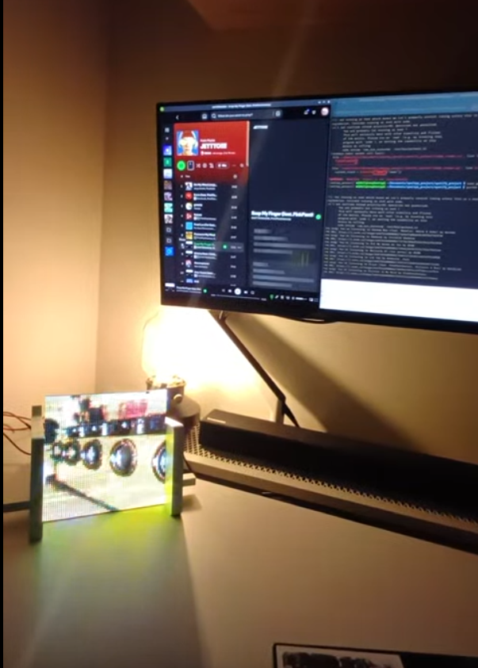

# SpotiPi
 
Displays currently playing Spotify album art on an RGB LED matrix panel, powered by a Raspberry Pi Zero W.
This program was done through SSH and taught me a lot about working with headless setups, API's and setting up virtual environments.
 
## How it works
 
- A Python process polls the Spotify API for the currently playing track
- A C++ component (using `rpi-rgb-led-matrix` and GraphicsMagick) renders the album art to the LED matrix
  
## Gallery
 
| | |
|---|---|
|  |  |
 
